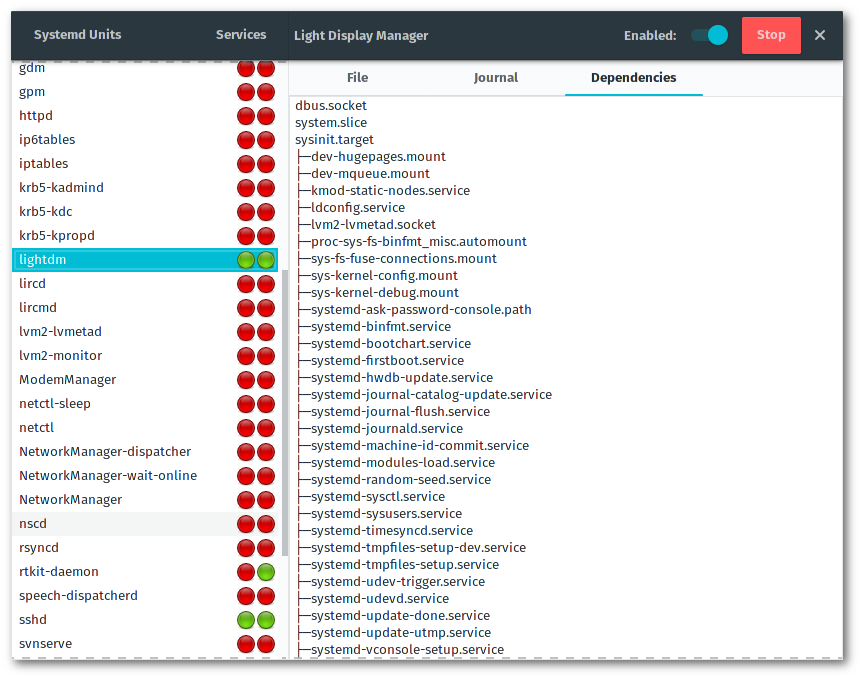
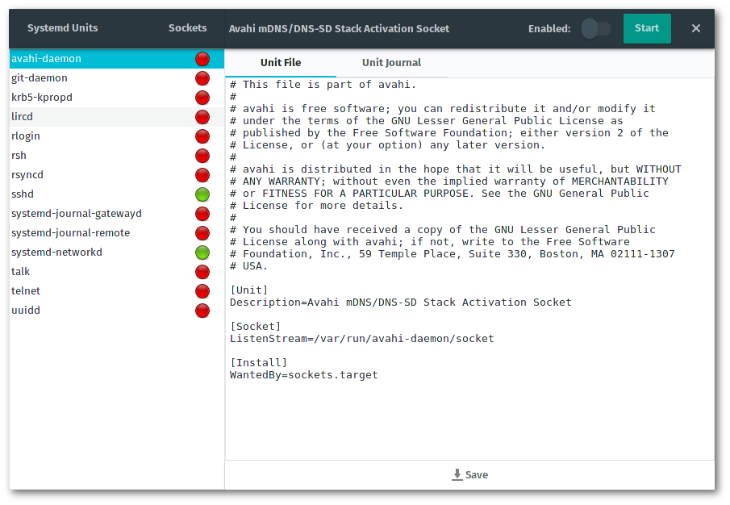
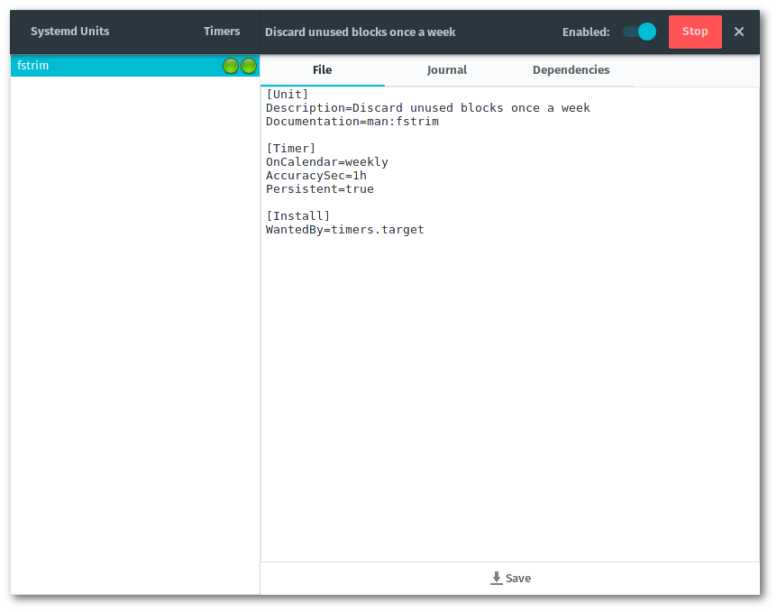
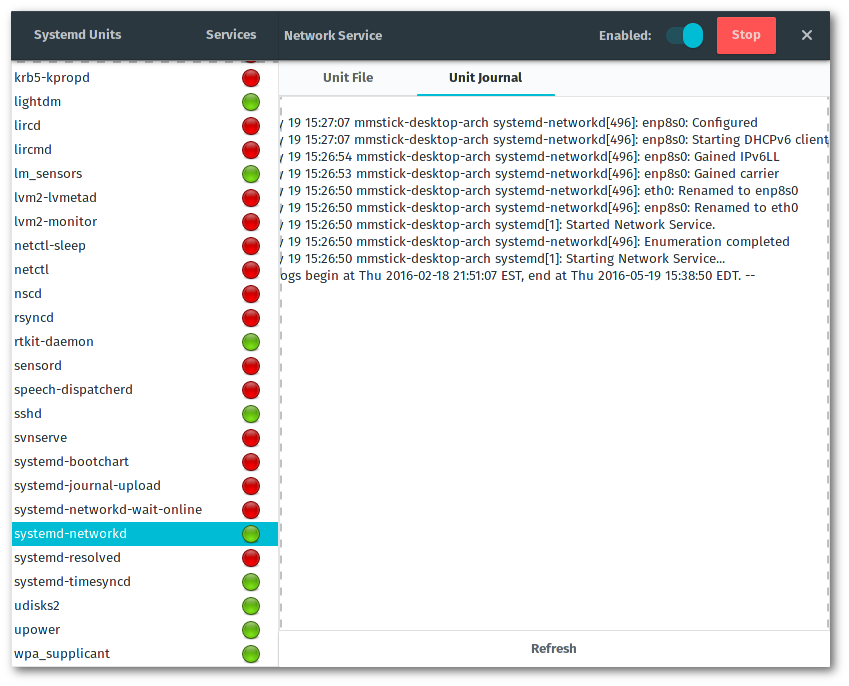
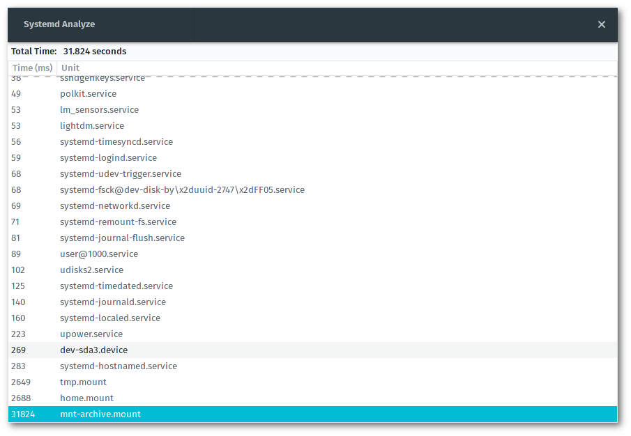

**Build Status:** [](https://travis-ci.org/mmstick/systemd-manager)

**Website:** <http://mmstick.github.io/systemd-manager/>

# Systemd Manager

This application is a systemd service manager written in the Rust programming language with GTK3 as the graphical user interface of choice. The units are filtered into three separate lists: services, sockets, and timers. As a unit is selected in the left pane, the right pane is updated with information pertaining to that unit, and the right headerbar is updated to reflect the status of the unit where you may disable/enable and start/stop the selected unit. Services are units that are activated immediately, sockets are units that are activated when they are needed, and timers are units that activate on a regular time interval. In addition to display units, the application also provides stats generated by `systemd-analyze` on the Systemd Analyze view.

## Screenshots











## Install Instructions

### Arch Linux

This is available in the AUR as a git package: [`systemd-manager-git`](https://aur.archlinux.org/packages/systemd-manager-git/).

### Ubuntu

Simply run this in a terminal to `wget` the Debian package and `dpkg -i` it.

```sh
wget https://github.com/mmstick/systemd-manager/releases/download/0.4.5/systemd-manager_0.4.5_amd64.deb
sudo dpkg -i systemd-manager_0.4.5_amd64.deb
```

### Building From Source

#### Ubuntu

For Ubuntu users, this will automatically install `libgtk-3-dev`, generate a systemd-manager Debian package and automatically install it.

```sh
git clone https://github.com/mmstick/systemd-manager && cd systemd-manager && make ubuntu
```

#### Everyone else

This will simply install directly to the /usr prefix. Simply install Rust via [rustup.rs](https://www.rustup.rs/) and execute `make & sudo make install`. The installation of Rust software is incredibly simple as the process is largely just `cargo build --release`, but this installation script will install all the files needed by the application for proper integration with **PolicyKit** into the correct places in the filesystem, which `cargo install` does not perform.

```sh
git clone https://github.com/mmstick/systemd-manager && cd systemd-manager && make && sudo make install
```

In the event that you would like to uninstall the application, simply run the following:

```sh
sudo make uninstall
```
